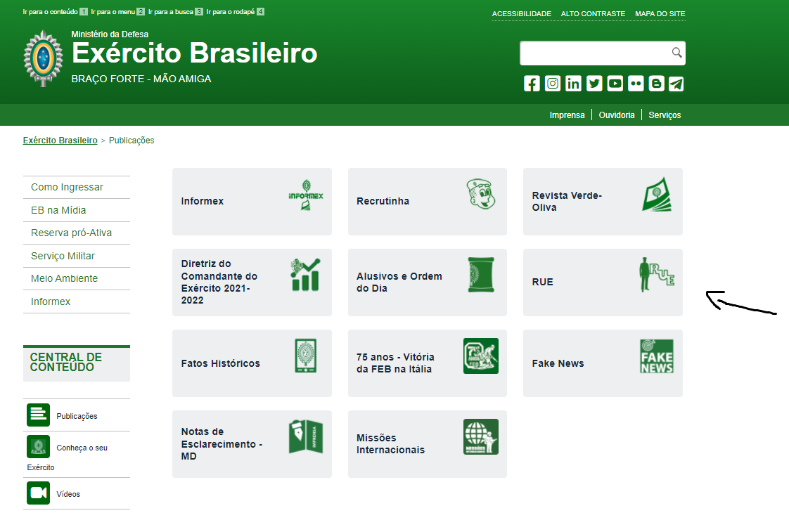

## 1. Introdução
Os princípios e diretrizes de um projeto definem os objetivos gerais demais alto nível e também regras gerais comumente vistas na prática. Norman (1998)
destaca a importância e a necessiadade de se projetar um sistema de forma que o 
usuário possa aprender rapidamente e sem muito esforço. Além disso, ele cita que 
o modelo conceitual deve ajudar na interpretação do relacionamento entre ações e
informações apresentadas pelo sistema.
Esse documento visa passar pelos pricípios e diretrizes mais utilizados em IHC.

## 2.Princípios e Diretrizes Gerais
### 2.1 Correspondência com as Expectativas dos Usuários 
O usuário tem uma expectativa que pode ser boa ou ruim sobre o sistema. Nesse sistema a sequência de ações devem ser o mais fidedigna possível para o usuário.
O exemplo abaixo nos mostra o que um recruta do exército precisa fazer para ter mais informações sobre seu uniforme no site avaliado do projeto.

<h6 align = "center">Figura 1: Foto da página principal do site do EB.</h6>
<h6 align = "center">Fonte: Autor.</h6>

<h6 align = "center">Figura 2: Foto da página publicações do site do EB.</h6>
<h6 align = "center">Fonte: Autor.</h6>

<h6 align = "center">Figura 3: Foto das publicaçõeso sobre regulamento de uniformes do EB .</h6>
<h6 align = "center">Fonte: Autor.</h6>

Caso fosse no quartel, o recruta teria que ir num local onde estariam as revistas(representado pelo link "publicações" no site do projeto), em seguida teria que ir na seção que os regulamentos de uniforme se encontram e para concluir
escolheria o caderno ou livro que lhe daria tal informação.

### 2.2 Simplicidade nas Estruturas das Tarefas
Norman (1998) recomenda deixar a estrutura de tarefas o mais simples possível, reduzindo ao máximo a quantidade de planejamento e resolução de problemas requerem. Para simplificar estruturas de tarefas complexas,
Norman indica aos designers a seguir 4 abordagens tecnológicas: 
a) manter a tarefa a mesma, mas fornecendo diversas formas de apoio para que os usuários consigam aprender e realizar a tarefa; 
b) usar tecnologia para tornar visível o que seria invisível, melhorando o feedback e a capacidade de o usuário se manter no controle da tarefa; 
c) automatizar a tarefa ou parte dela, mantendo-a igual;
d) modificar a natureza da tarefa

### 2.3 Consistência e Padronização
Facilitar o aprendizado do uso do sistema é recomendado, para isso a interface deve ser consistente e padronizada. A consistência mais importante é com as expectativas do usuário (Tognazzini, 2003), é recomendável padronizar ações,
resultados das ações, layout dos diálogos e as visualizações de informação.

### 2.4 Promovendo a Eficiência do Usuário
É recomendavel sempre considerar a eficiência do usuário em primeiro lugar, e não a do computador (TOGAZZINI, 2003). Pessoas são mais custosas do que máquinas, promover uma economia de tempo e esforço do usuário trazem
mais benefícios do que economias semelhantes de processamento ou armazenamento.
O sistema deve ser sensível ao que o usuário está fazendo e não deve interrompê-lo desnecessariamente enquanto o usuário estiver trabalhando em algo. O sistema também deve se lembrar de tudo o que o usuário disse, para não perguntar de 
novo, e se manter informado sobre o usuário.(COOPER, 1999)

## 4 Versionamento
|Versão|Data|Descrição|Autor|Revisor|
|------|----|:---------:|-----|-----|
|0.1|10/03/2022| Criação do documento e dos tópicos 1, 2 [2.1 - 2.4] | [Kevin Batista](https://github.com/k3vin-batista)|-|

