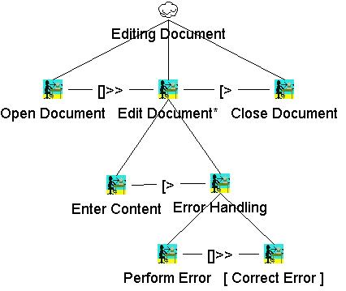

# 1. Definição
**ConcurTaskTrees (CTT)** é uma notação para especificações de modelo de tarefa que foi desenvolvida  para podermos superar as limitações das notações usadas para projetar aplicativos interativos. Seu objetivo principal é ser uma notação fácil de usar de forma a  suportar o projeto de aplicações.

## 1.1 As principais características do ConcurTaskTrees são:

- **Estrutura hierárquica** feita para ser algo muito intuitivo, muitas vezes quando as pessoas têm que resolver um problema elas tendem a decompô-lo em problemas menores para manter as relações entre as partes e encontrar solução menores;

- **Sintaxe gráfica**, que é uma forma mais fácil de interpretar e deve refletir a estrutura lógica para que tenha uma forma de árvore;

- **Foco nas atividades**, dessa forma permite que os designers se concentrem nos aspectos mais relevantes ao projetar aplicativos interativos em relação ao usuário e ao sistema.

- **Notação expressiva e flexível**, tornando capaz de representar atividades simultâneas e interativas, trazendo a possibilidade de suportar a cooperação entre múltiplos usuários e possíveis interrupções;

- **Representação compacta e compreensível**, a capacidade de fornecer muitas informações de forma intuitiva sem exigir esforços excessivos dos usuários da notação fazem parte para alcançar o sucesso dela. 

## 1.2 Descrevendo Erros por CTT
As abordagens tradicionais de modelagem de tarefas tendem a descrever comportamentos livres de erros, como Hierarchical Task Analysis (HTA) ou GOMS. Já as abordagens mais recentes, como os CTT, passam essa limitação graças ao uso de operadores temporais, que nos permite descrever comportamentos mais próximos da realidade de forma mais flexível.
<figcaption>Figura 1: Descrevendo Erros por CTT</figcaption>

    
    <figcaption>Fonte: Página do site w3</figcaption>
    <figcaption>Disponível em: <a href="https://www.w3.org/2005/Incubator/model-based-ui/wiki/File:Error.jpg"> < https://www.w3.org/2005/Incubator/model-based-ui/wiki/File:Error.jpg ></a></figcaption>

# 2. Referências bibliográficas
> Coralie. ConcurTaskTrees. w3, 2009. Disponível em: <https://www.w3.org/2005/Incubator/model-based-ui/wiki/ConcurTaskTrees/>. Acesso em: 27 de fev. de 2022.

|Versão|Data|Descrição|Autor|Revisor|
|------|----|:---------:|-----|-----|
|0.1|27/02/2022| Adicionado Análise CTT | [Eduarda Tavares](https://github.com/etavares) ||
