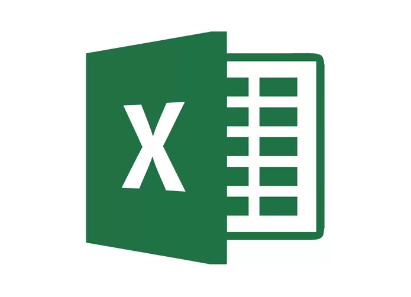

# Planejamento do Projeto

## 1. Cronograma
### 1.1 Cronograma de atividades
|Título|Data de conclusão da tarefa proposta|Data de entrega da apresentação|Descrição|
|:----------:|:-----------------------------:|:-----------------:|:--------------:|
|Entrega 1|11/02|13/02|Planejamento do Projeto e Processo de Design|
|Entrega 2|25/02|27/02|Perfil do Usuário, Personas e Análise de Tarefas|
|Entrega 3|10/03|12/03|Princípios Gerais de Projeto, Metas de usabilidade, Guia de Estilo. (Fase: análise de requisitos)|
|Entrega 4|14/03|16/03|Planejamento da Avaliação do Storyboard e Análise de tarefas, planejamento do relato dos resultados da avaliação do Storyboard e o planejamento do relato dos resultados da avaliação do Análise de tarefas|
|Entrega 5|28/03|30/03|Relato dos resultados do Story Board e da Análise de tarefas, o Planejamento da Avaliação do Protótipo de Papel e do Planejamento do relato dos resultados da avaliação do Protótipo de Papel|
|Entrega 6|04/04|06/04|Verificação dos artefatos|
|Entrega 7|09/04|11/04|Relato dos resultados do Protótipo de Papel, o Planejamento da Avaliação do protótipo de alta fidelidade e o planejamento do relato dos resultados da avaliação do protótipo de alta fidelidade|
|Entrega Final|23/04|25/04|Entrega final do projeto|  

### 1.2 Divisão de atividades 
#### Entrega 1
|    Integrantes    |      Atividade(s)      | Data Realizada|
| :--------: | ------------- | ------------ |
| Daniel Coimbra | Processo de design |13/02/2022|
| Eduarda Tavares | Processo de design |13/02/2022|
| Heitor Marques | Sites avaliados e escolhido |09/02/2022|
| João Alves | Ferramentas |11/02/2022|
| Kevin Luis | Cronograma e metodologia do projeto |10/02/2022|
| Levi Queiroz | Processo de design |13/02/2022|

#### Entrega 2
|    Integrantes    |      Atividade(s)      | Data Realizada|
| :--------: | ------------- | ------------ |
| Eduarda Tavares | Análise de Tarefas: CTT e Vídeo ||
| Heitor Marques | Personas, Divisão Entrega 2 |22/02/2022|
| Heitor Marques | Análise de Tarefas: CMN-GOMS|26/02/2022|
| João Alves | Perfil do Usuário |24/02/2022|
| Kevin Luis | Análise Tarefa: HTA |25/02/2022|
| Levi Queiroz | Análise de Tarefas: KLM ||

## 2. Ferramentas utilizadas
| Ferramenta | Nome | Descrição |
|:--:|:--:|:--:|
|       | Exército Brasileiro | Site do Exército Brasileiro, escolhido para avaliação |
|                | GitHub | Ferramenta utilizada para controle de versionamento de código |
|          | Microsoft Word|Editor de documentos .doc|
|        | Microsoft Teams|Ferramenta de chamada e gravação de vídeos|
|                    | Loom | Plataforma para gravação de vídeos, utilizado nas apresentações |
|                  | Canva|Plataforma utilizada na produção de slides|
|                | Visual Studio Code | Editor de código-fonte |
|                  | Figma|Ferramenta utilizada na criação de protótipos de alta fidelidade |
|                  | Google Drive | Plataforma de armazenamento de arquivos na nuvem |
|                  | Microsoft Excel | Editor de planilhas |
|            | WhatsApp | Aplicativo de comunicação utilizado no dia à dia |
|               | Draw.io  | Ferramenta para criação de diagramas |

## Versionamento

|Versão|Data|Descrição|Autor|Revisor|
|------|----|:---------:|-----|-----|
|0.1|09/02/2022|Criado base do planejamento|[Heitor Marques](github.com/heitormsb)||
|0.2|09/02/2022|Adicionado sites avaliados e escolhido|[Heitor Marques](github.com/heitormsb)||
|0.3|10/02/2022| Criação do cronograma | [Kevin Batista](https://github.com/k3vin-batista) |[Heitor Marques](github.com/heitormsb)|
|0.4|10/02/2022| Edição da divisão de tarefas da entrega 1 | [Kevin Batista](https://github.com/k3vin-batista) ||
|0.5|11/02/2022| Adicionado as ferramentas do projeto | [João Alves](https://github.com/Joaoaalves) |[Heitor Marques](github.com/heitormsb)|
|0.6|22/02/2022| Retirado Sites avaliados e movido pagina propria | [Heitor Marques](github.com/heitormsb)||
|0.7|22/02/2022| Adicionado divisão de tarefas da entrega 2 | [Heitor Marques](github.com/heitormsb)||
