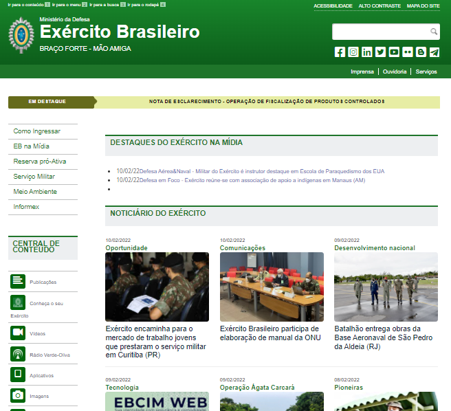

# Planejamento

## 1. Sites avaliados
### 1.1 Sites avaliados individualmente
Os sites avaliados pelos integrantes do grupo foram: 

- [**Prefeitura de São Sebastião do Alto**](http://ssalto.rj.gov.br/) - Realizada por: [Eduarda Tavares](https://github.com/erteduarda) 
- [**Exército Brasileiro**](https://www.eb.mil.br/) - Realizada por: [Heitor Marques](https://github.com/heitormsb) 
- [**SIGAA**](http://sig.unb.br/) -  Realizada por: [João Alves](https://github.com/Joaoaalves) 
- [**Senado Federal**](https://www12.senado.leg.br/hpsenado) -  Realizada por: [Kevin Luis](https://github.com/k3vin-batista) 
- **Não enviou** -  <s>Realizada por:</s> [Levi Queiroz](https://github.com/LeviQ27) 
- [**Governo do Distrito Federal**](http://www.df.gov.br/) -  Realizada por: [Daniel Coimbra](https://github.com/DanielCoimbra) 

### 1.2 Site escolhido
Por uma reunião realizada com o grupo no dia 08/02/2022 e após análise da avaliação individual de todos integrantes, foi escolhido a avaliação do site do [Exército Brasileiro](https://www.eb.mil.br/) para a disciplina. A avaliação esta diponivel neste [link](https://docs.google.com/document/d/1emHM_Uok_XaT4gulwMliECSgZbMmppMcVZiRdROFzJY/edit?usp=sharing).  

## 2. Cronograma
### 2.1 Cronograma de atividades
|Título|Data de conclusão da tarefa proposta|Data de entrega da apresentação|Descrição|
|:----------:|:-----------------------------:|:-----------------:|:--------------:|
|Entrega 1|11/02|13/02|Planejamento do Projeto e Processo de Design|
|Entrega 2|25/02|27/02|Perfil do Usuário, Personas e Análise de Tarefas|
|Entrega 3|10/03|12/03|Princípios Gerais de Projeto, Metas de usabilidade, Guia de Estilo. (Fase: análise de requisitos)|
|Entrega 4|14/03|16/03|Planejamento da Avaliação do Storyboard e Análise de tarefas, planejamento do relato dos resultados da avaliação do Storyboard e o planejamento do relato dos resultados da avaliação do Análise de tarefas|
|Entrega 5|28/03|30/03|Relato dos resultados do Story Board e da Análise de tarefas, o Planejamento da Avaliação do Protótipo de Papel e do Planejamento do relato dos resultados da avaliação do Protótipo de Papel|
|Entrega 6|04/04|06/04|Verificação dos artefatos|
|Entrega 7|09/04|11/04|Relato dos resultados do Protótipo de Papel, o Planejamento da Avaliação do protótipo de alta fidelidade e o planejamento do relato dos resultados da avaliação do protótipo de alta fidelidade|
|Entrega Final|23/04|25/04|Entrega final do projeto|
### 2.2 Divisão de atividades 
#### Entrega 1
|    Integrantes    |      Atividade(s)      |
| :--------: | ------------- |
| Kevin Luis | Cronograma do projeto |
| Eduarda Tavares |  |
| Heitor Marques |  |
| João Alves |  |
| Levi Queiroz |  |
| Daniel Coimbra |  |

Entrega 1

...

## 3. Ferramentas utilizadas
...

## Versionamento

|Versão|Data|Descrição|Autor|
|------|----|---------|-----|
|0.1|09/02/2022|Criado base do planejamento|[Heitor Marques](github.com/heitormsb)|
|0.2|09/02/2022|Adicionado sites avaliados e escolhido|[Heitor Marques](github.com/heitormsb)|
|0.3|10/02| Criação do cronograma | Kevin Batista |